<div align="center">

# ❄️ Cold Storage

### Enterprise Warehouse Management for Service-Based Cold Storage Operations

[](https://frappeframework.com)
[](https://erpnext.com)
[](https://python.org)
[](LICENSE)

---

*A complete Frappe/ERPNext application for managing cold storage warehouse operations — from goods receipt to dispatch — with automated billing, advanced inventory tracking, and a modern self-service client portal.*

</div>

---

## 🎯 Overview

Cold Storage is built for **service-based warehouse businesses** that store goods on behalf of customers and charge for storage and handling services. Unlike trading-focused inventory systems, this app is designed around the unique workflows of cold storage facilities:

- **Receive** goods from customers → **Store** them in temperature-controlled warehouses → **Dispatch** on demand → **Bill** for services automatically

```mermaid
graph LR
    A["📦 Inward<br/>Goods Receipt"] --> B["🏭 Storage<br/>Warehouse"]
    B --> C["🚚 Outward<br/>Dispatch"]
    B --> D["🔄 Transfer<br/>Ownership / Location"]
    A --> E["💰 Auto Invoice<br/>Service Charges"]
    C --> E
    D --> E
    style A fill:#059669,color:#fff,stroke:none
    style B fill:#0284c7,color:#fff,stroke:none
    style C fill:#d97706,color:#fff,stroke:none
    style D fill:#7c3aed,color:#fff,stroke:none
    style E fill:#dc2626,color:#fff,stroke:none
```



---

## ✨ Key Features

<table>
<tr>
<td width="50%">

### 📦 Inward / Outward / Transfer
Complete transaction lifecycle with strict customer-batch ownership, automatic Stock Entry creation, and real-time inventory updates.

</td>
<td width="50%">

### 💰 Automated Billing
Sales Invoices and Journal Entries are auto-created on submit based on configurable charge rates per Item Group.

</td>
</tr>
<tr>
<td>

### 🌐 Self-Service Client Portal
A modern, full-width dashboard at `/client-portal` with real-time KPIs, stock composition charts, movement trends, and Executive PDF report downloads.

</td>
<td>

### 📊 7 Built-In Reports
Inward Register, Outward Register, Transfer Register, Customer Register, Warehouse Utilization, Occupancy Timeline, and Yearly Trend analysis.

</td>
</tr>
<tr>
<td>

### 🔐 9-Role Access Control
Granular role-based permissions from Admin to Dispatch Operator, with automated Role Profile sync and customer-scoped portal access.

</td>
<td>

### 📱 QR Code Print Formats
Professional print formats for Inward Receipts, Outward Dispatches, and Transfers — each embedded with scannable QR codes.

</td>
</tr>
<tr>
<td>

### 💬 WhatsApp Integration (Meta Cloud API)
Company-scoped WhatsApp notifications for Inward/Outward submit events, with template mode, text fallback mode, setup diagnostics, and test-message tools.

</td>
<td>

### 🧰 Advanced Operations UX
Smart field filtering (batches by customer, warehouse by stock), Live Available Quantities in child tables, one-click WhatsApp notifications, and guided setups.

</td>
</tr>
</table>

---

## 🏛️ Architecture

### Core DocTypes

| DocType | Purpose | Auto-Creates |
|---------|---------|-------------|
| **Cold Storage Settings** | Global config: company, accounts, charge rates | — |
| **Cold Storage Inward** | Record goods received from customers | Stock Entry + Sales Invoice |
| **Cold Storage Outward** | Record goods dispatched to customers | Stock Entry + Sales Invoice |
| **Cold Storage Transfer** | Ownership or location transfers | Stock Entry + Journal Entry |

Each transaction DocType has a child table (`Inward Item`, `Outward Item`, `Transfer Item`) for line-item details including item, batch, quantity, and UOM. The child tables dynamically display the **Available Quantity** for selected batches to prevent over-dispatching.

### Custom Fields on Standard DocTypes

| DocType | Field | Purpose |
|---------|-------|---------|
| **Batch** | `custom_customer` | Enforces strict batch → customer ownership |
| **Warehouse** | `custom_storage_capacity` | Maximum storable quantity for utilization analytics |

---

## 📊 Reports & Exports

| Report & Export | Description |
|-----------------|-------------|
| 📥 **Inward Register** | All goods received with customer, item, batch, and date filters |
| 📤 **Outward Register** | All dispatches with quantity and date tracking |
| 🔄 **Transfer Register** | Ownership and location transfer history |
| 👤 **Customer Register** | Customer-wise stock summary and activity |
| 📈 **Warehouse Utilization** | Current capacity usage vs. `custom_storage_capacity` |
| 📅 **Occupancy Timeline** | Historical warehouse occupancy over time |
| 📉 **Yearly Trend** | Annual inward/outward movement patterns and seasonal analysis |
| 🏢 **Product Brochure** | Downloadable Marketing PDF covering app scope (`/api/method/cold_storage.api.client_portal.download_brochure`) |

---

## 🌐 Client Portal

The self-service portal at `/client-portal` gives customers real-time visibility into their storage operations. The layout features **Dynamic Aesthetic Design** optimized for high visual impact and analytical transparency.

| Feature | Description |
|---------|-------------|
| 📊 **Dashboard KPIs** | Outstanding amount, inward volume, stock count — at a glance |
| 🥧 **Stock Composition** | Visual breakdown of stored items by quantity |
| 📈 **Movement Trends** | 30-day inward/outward bar chart |
| 📋 **Stock Movements** | Filterable table of all transactions |
| 📥 **Snapshot PDF** | Downloadable Executive Summary Report in PDF format |
| 🔍 **Smart Search** | Keyboard-shortcut (`/`) powered search across all data |
| 👤 **Customer Scope** | Portal users see only their own data; admins can filter by customer |

---

## 🔐 Roles & Permissions

Roles are managed in code and synced automatically on install/migrate:

| Role | Scope |
|------|-------|
| 🛡️ **Cold Storage Admin** | Full access to all doctypes and settings |
| 🏭 **Warehouse Manager** | Manage warehouses, view all transactions |
| 📥 **Inbound Operator** | Create and manage Inward documents |
| 📤 **Dispatch Operator** | Create and manage Outward documents |
| 📦 **Inventory Controller** | View stock, manage transfers |
| 💰 **Billing Executive** | Access invoicing and accounting entries |
| 🌐 **Client Portal User** | Self-service portal access (customer-scoped) |
| 🔍 **Quality Inspector** | Inspection and quality workflows |
| 🔧 **Maintenance Technician** | Equipment and facility management |

---

## 🏷️ Naming Convention

All operational Cold Storage DocTypes use a **company-abbreviation prefix** in naming.

- Transaction masters use series like: `ABBR-CS-IN-.YYYY.-`, `ABBR-CS-OUT-.YYYY.-`, `ABBR-CS-TR-.YYYY.-`
- Cold-storage-generated accounting docs use prefixed series for Stock Entry / Sales Invoice / Journal Entry / GL Entry.
- Child DocTypes in Cold Storage also receive company-prefixed names (for example item rows and charge rows).

---

## 🚀 Installation

### Prerequisites

- [Frappe Bench](https://frappeframework.com/docs/user/en/installation) (v16+)
- [ERPNext](https://erpnext.com) (required dependency)
- Python **3.14+**

### Quick Start

```bash
# Navigate to your bench directory
cd $PATH_TO_YOUR_BENCH

# Get the app
bench get-app https://github.com/UmaishSolutions/Cold_Storage.git

# Install on your site
bench --site <site-name> install-app cold_storage
bench --site <site-name> migrate
bench --site <site-name> clear-cache
```

### Post-Install Checklist

1. **Configure Settings** → Open `Cold Storage Settings` and set:
   - Default Company
   - Default Income Account
   - Labour Account (Debit) / Labour Manager Account (Credit)
   - Transfer Expense Account
   - Charge Configurations per Item Group

2. **Set Warehouse Capacities** → Update `Warehouse.custom_storage_capacity` for utilization analytics

3. **Assign Roles** → Apply Cold Storage Role Profiles to your users

4. **Portal Users** → Map customers through `Customer > portal_users` or the contact email

5. **(Optional) WhatsApp Setup** → In `Cold Storage Settings`, enable WhatsApp and configure settings.

---

## 🛠️ Administration

### Sync Security & Portal Mappings

```bash
# Re-apply role-based access control
bench --site <site-name> execute cold_storage.setup.role_based_access.sync_role_based_access

# Re-sync portal user → customer mappings
bench --site <site-name> execute cold_storage.setup.client_portal_user_permissions.sync_customer_user_permissions_for_client_portal_users

bench --site <site-name> clear-cache
```

---

## 💬 WhatsApp Integration (Meta Cloud API)

The app includes company-scoped WhatsApp notifications for `Cold Storage Inward` and `Cold Storage Outward`.

### Setup Flow

1. Open `Cold Storage Settings`.
2. Enable `WhatsApp Integration`.
3. Configure required credentials:
   - `Phone Number ID`
   - `Permanent Access Token`
   - `Meta Graph API Version` (example: `v22.0`)
4. Configure delivery behavior:
   - Auto notify on submit (Inward/Outward)
   - Template names (Meta approved) and body params JSON
   - Or text templates as fallback
5. Use **WhatsApp > Check Setup** in settings.
6. Use **WhatsApp > Send WhatsApp Test** before going live.

### Day-to-Day Operations

- In submitted Inward/Outward documents:
  - Use **WhatsApp > Send Notification** to manually resend a notification.
- Integration is restricted to the `Cold Storage Settings.company` scope.

---

## 🧪 Development

### Setup

```bash
cd apps/cold_storage
pre-commit install
pre-commit run --all-files
```

### Run Tests

```bash
bench --site <site-name> set-config allow_tests true
bench --site <site-name> run-tests --app cold_storage
```

### Code Quality

- **Production-Ready**: Removed all debug statements and TODOs structure.
- **Linting**: Ruff with `line-length = 110`, targeting Python 3.14
- **Type Safety**: All whitelisted API methods require type annotations
- **Pre-commit**: Automated formatting and lint checks

---

## 🐛 Troubleshooting

<details>
<summary><strong>❌ Install error: "Could not find Default UOM: Nos"</strong></summary>

Run `bench --site <site-name> migrate` to apply post-install handlers. Ensure at least one enabled UOM exists.
</details>

<details>
<summary><strong>❌ Portal user cannot see records</strong></summary>

1. Verify user has the `Cold Storage Client Portal User` role
2. Verify `User Permission` records exist for the Customer
3. Re-run the sync commands from the Administration section above
</details>

<details>
<summary><strong>❌ Permission matrix drift after manual edits</strong></summary>

Re-run `sync_role_based_access` to restore the code-defined permission matrix.
</details>

---

## 🔄 CI/CD

| Workflow | Purpose |
|----------|---------|
| `ci.yml` | Installs app on a fresh bench and runs the full test suite |
| `linter.yml` | Pre-commit hooks, Semgrep analysis, and dependency audit |

For push/PR readiness, run the checklist in [`GITHUB_READY_CHECKLIST.md`](GITHUB_READY_CHECKLIST.md).

---

## 📜 License

This project is licensed under the **MIT License**. See [LICENSE](LICENSE) for details.

---

<div align="center">

**Built with ❤️ by [Umaish Solutions](mailto:solutions@umaish.com)**

*Powered by [Frappe Framework](https://frappeframework.com) & [ERPNext](https://erpnext.com)*

</div>
