<div align="center">

# ❄️ Cold Storage

### Enterprise Warehouse Management for Service-Based Cold Storage Operations

[](https://frappeframework.com)
[](https://erpnext.com)
[](https://python.org)
[](LICENSE)

---

*A complete Frappe/ERPNext application for managing cold storage warehouse operations — from goods receipt to dispatch — with automated billing, advanced inventory tracking, and a modern self-service client portal.*

</div>

---

## 🎯 Overview

Cold Storage is built for **service-based warehouse businesses** that store goods on behalf of customers and charge for storage and handling services. Unlike trading-focused inventory systems, this app is designed around the unique workflows of cold storage facilities:

- **Receive** goods from customers → **Store** them in temperature-controlled warehouses → **Dispatch** on demand → **Bill** for services automatically

```mermaid
graph LR
    A["📦 Inward<br/>Goods Receipt"] --> B["🏭 Storage<br/>Warehouse"]
    B --> C["🚚 Outward<br/>Dispatch"]
    B --> D["🔄 Transfer<br/>Ownership / Location"]
    A --> E["💰 Auto Invoice<br/>Service Charges"]
    C --> E
    D --> E
    style A fill:#059669,color:#fff,stroke:none
    style B fill:#0284c7,color:#fff,stroke:none
    style C fill:#d97706,color:#fff,stroke:none
    style D fill:#7c3aed,color:#fff,stroke:none
    style E fill:#dc2626,color:#fff,stroke:none
```



---

## ✨ Key Features

<table>
<tr>
<td width="50%">

### 📦 Inward / Outward / Transfer
Complete transaction lifecycle with strict customer-batch ownership, automatic Stock Entry creation, and real-time inventory updates.

</td>
<td width="50%">

### 💰 Automated Billing
Sales Invoices and Journal Entries are auto-created on submit based on configurable charge rates per Item Group.

</td>
</tr>
<tr>
<td>

### 🌐 Self-Service Client Portal
A modern, full-width SPA dashboard at `/cs-portal` (160KB) with real-time KPIs, stock composition charts, movement trends, Executive PDF downloads, and product brochure access.

</td>
<td>

### 📊 11 Built-In Reports
Inward Register, Outward Register, Transfer Register, Customer Register, Warehouse Utilization, Occupancy Timeline, Yearly Trend, Live Batch Stock, Net Movement Waterfall, Audit Trail & Compliance Pack, Client Portal Access Log, and Login Activity Log.

</td>
</tr>
<tr>
<td>

### 🔐 9-Role Access Control + Permissions Dashboard
Granular role-based permissions from Admin to Dispatch Operator, with automated Role Profile sync, customer-scoped portal access, and a centralized **Roles & Permissions** matrix page at `/app/cs-permissions`.

</td>
<td>

### 📱 4 QR Code Print Formats
Professional print layouts with embedded scannable QR codes: Inward Half A4, Outward Dispatch QR, Outward Half A4, and Transfer QR.

</td>
</tr>
<tr>
<td>

### 💬 WhatsApp Integration (Meta Cloud API)
Company-scoped WhatsApp notifications for Inward/Outward submit events, with template mode, text fallback mode, setup diagnostics, and test-message tools.

</td>
<td>

### 🧰 Advanced Operations UX
Smart field filtering (batches by customer, warehouse by stock), live available quantities in child tables, one-click WhatsApp notifications, guided setups, and dashboard report PDF templates.

</td>
</tr>
</table>

---

## 🏛️ Architecture

### Core DocTypes

| DocType | Purpose | Auto-Creates |
|---------|---------|-------------|
| **Cold Storage Settings** | Global config: company, accounts, charge rates, WhatsApp, portal | — |
| **Charge Configuration** | Per-Item-Group billing rates (child table of Settings) | — |
| **Cold Storage Inward** | Record goods received from customers | Stock Entry + Sales Invoice |
| **Cold Storage Outward** | Record goods dispatched to customers | Stock Entry + Sales Invoice |
| **Cold Storage Transfer** | Ownership or location transfers | Stock Entry + Journal Entry |

Each transaction DocType has a child table (`Inward Item`, `Outward Item`, `Transfer Item`) for line-item details including item, batch, quantity, and UOM. The child tables dynamically display the **Available Quantity** for selected batches to prevent over-dispatching.

### Custom Fields on Standard DocTypes

| DocType | Field | Purpose |
|---------|-------|---------|
| **Batch** | `custom_customer` | Enforces strict batch → customer ownership |
| **Warehouse** | `custom_storage_capacity` | Maximum storable quantity for utilization analytics |

### Custom Pages

| Page | Route | Purpose |
|------|-------|---------|
| **CS Roles & Permissions** | `/app/cs-permissions` | Centralized permission matrix for all CS doctypes and portal access |

---

## 📊 Reports & Exports

| # | Report | Description |
|---|--------|-------------|
| 1 | 📥 **Inward Register** | All goods received with customer, item, batch, and date filters |
| 2 | 📤 **Outward Register** | All dispatches with quantity and date tracking |
| 3 | 🔄 **Transfer Register** | Ownership and location transfer history |
| 4 | 👤 **Customer Register** | Customer-wise stock summary and activity |
| 5 | 📈 **Warehouse Utilization** | Current capacity usage vs. `custom_storage_capacity` |
| 6 | 📅 **Occupancy Timeline** | Historical warehouse occupancy over time |
| 7 | 📉 **Yearly Trend** | Annual inward/outward movement patterns and seasonal analysis |
| 8 | 📦 **Live Batch Stock** | Real-time batch-wise stock position across warehouses |
| 9 | 📊 **Net Movement Waterfall** | Monthly net movement (inward − outward) waterfall chart |
| 10 | 🔍 **Audit Trail & Compliance Pack** | Document audit trails for regulatory compliance |
| 11 | 🌐 **Client Portal Access Log** | Portal usage tracking — who accessed what and when |
| 12 | 🔑 **Login Activity Log** | User login events and patterns |
| — | 🏢 **Product Brochure** | Downloadable marketing PDF covering app scope |

---

## 🖨️ Print Formats

| Print Format | DocType | Description |
|-------------|---------|-------------|
| **Inward Half A4** | Cold Storage Inward | Compact receipt with QR code for goods received |
| **Outward Dispatch QR** | Cold Storage Outward | Dispatch document with embedded scannable QR |
| **Outward Half A4** | Cold Storage Outward | Compact dispatch receipt format |
| **Transfer QR** | Cold Storage Transfer | Transfer confirmation with QR code |

All print formats include embedded QR codes for quick document lookup via mobile scanning, powered by the Jinja utilities `get_document_qr_code_data_uri` and `get_document_sidebar_qr_code_data_uri`.

---

## 🌐 Client Portal

The self-service portal at `/cs-portal` gives customers real-time visibility into their storage operations. Built as a **160KB single-page application** with Frappe Charts integration, the portal features a modern full-width layout optimized for both desktop and mobile.

| Feature | Description |
|---------|-------------|
| 📊 **Dashboard KPIs** | Outstanding amount, inward volume, stock count — at a glance |
| 🥧 **Stock Composition** | Visual breakdown of stored items by quantity |
| 📈 **Movement Trends** | 30-day inward/outward bar chart |
| 📋 **Stock Movements** | Filterable table of all transactions |
| 📥 **Executive Snapshot PDF** | Downloadable Executive Summary Report in PDF format |
| 🏢 **Product Brochure** | Marketing PDF download from within the portal |
| 🔍 **Smart Search** | Keyboard-shortcut (`/`) powered search across all data |
| 👤 **Customer Scope** | Portal users see only their own data; admins can filter by customer |
| 📢 **Announcements** | Admin-configurable announcements displayed in the portal header |
| 📦 **Batch Stock Details** | Detailed batch-wise stock with quantities and warehouse locations |
| 💳 **Outstanding Invoices** | View unpaid invoices and payment history |

### Portal API Endpoints

| Endpoint | Purpose |
|----------|---------|
| `get_portal_dashboard` | Dashboard KPIs, composition, trends, announcements |
| `get_batch_stock_details` | Batch-wise stock position |
| `get_movement_history` | Inward/outward/transfer history |
| `get_invoices` | Outstanding and paid invoice listing |
| `download_portal_report_pdf` | Customer-scoped report PDF download |
| `download_brochure` | Product brochure PDF download |

---

## 🔐 Roles & Permissions

Roles are managed in code and synced automatically on install/migrate. A centralized **Permissions Dashboard** is available at `/app/cs-permissions` for an at-a-glance matrix view.

| Role | Scope |
|------|-------|
| 🛡️ **Cold Storage Admin** | Full access to all doctypes and settings |
| 🏭 **Warehouse Manager** | Manage warehouses, view all transactions |
| 📥 **Inbound Operator** | Create and manage Inward documents |
| 📤 **Dispatch Operator** | Create and manage Outward documents |
| 📦 **Inventory Controller** | View stock, manage transfers |
| 💰 **Billing Executive** | Access invoicing and accounting entries |
| 🌐 **Client Portal User** | Self-service portal access (customer-scoped) |
| 🔍 **Quality Inspector** | Inspection and quality workflows |
| 🔧 **Maintenance Technician** | Equipment and facility management |

> **Permissions Dashboard** — Visit `/app/cs-permissions` to see all roles × doctypes × 12 permission types in one interactive matrix. System Managers can click to toggle permissions directly.

---

## 🏷️ Naming Convention

All operational Cold Storage DocTypes use a **company-abbreviation prefix** in naming.

- Transaction masters use series like: `ABBR-CS-IN-.YYYY.-`, `ABBR-CS-OUT-.YYYY.-`, `ABBR-CS-TR-.YYYY.-`
- Cold-storage-generated accounting docs use prefixed series for Stock Entry / Sales Invoice / Journal Entry / GL Entry.
- Child DocTypes in Cold Storage also receive company-prefixed names (for example item rows and charge rows).

---

## 🚀 Installation

### Prerequisites

- [Frappe Bench](https://frappeframework.com/docs/user/en/installation) (v16+)
- [ERPNext](https://erpnext.com) (required dependency)
- Python **3.14+**

### Quick Start

```bash
# Navigate to your bench directory
cd $PATH_TO_YOUR_BENCH

# Get the app
bench get-app https://github.com/UmaishSolutions/Cold_Storage.git

# Install on your site
bench --site <site-name> install-app cold_storage
bench --site <site-name> migrate
bench --site <site-name> clear-cache
```

### Post-Install Checklist

1. **Configure Settings** → Open `Cold Storage Settings` and set:
   - Default Company
   - Default Income Account
   - Labour Account (Debit) / Labour Manager Account (Credit)
   - Transfer Expense Account
   - Charge Configurations per Item Group

2. **Set Warehouse Capacities** → Update `Warehouse.custom_storage_capacity` for utilization analytics

3. **Assign Roles** → Apply Cold Storage Role Profiles to your users

4. **Portal Users** → Map customers through `Customer > portal_users` or the contact email

5. **(Optional) WhatsApp Setup** → In `Cold Storage Settings`, enable WhatsApp and configure Meta Cloud API credentials

---

## 🛠️ Administration

### Sync Security & Portal Mappings

```bash
# Re-apply role-based access control
bench --site <site-name> execute cold_storage.setup.role_based_access.sync_role_based_access

# Re-sync portal user → customer mappings
bench --site <site-name> execute cold_storage.setup.client_portal_user_permissions.sync_customer_user_permissions_for_client_portal_users

bench --site <site-name> clear-cache
```

### Patch History

The app includes **19 migration patches** for schema upgrades, data migrations, and feature rollouts — all managed via `patches.txt` and applied automatically during `bench migrate`.

---

## 💬 WhatsApp Integration (Meta Cloud API)

The app includes company-scoped WhatsApp notifications for `Cold Storage Inward` and `Cold Storage Outward`.

### Setup Flow

1. Open `Cold Storage Settings`.
2. Enable `WhatsApp Integration`.
3. Configure required credentials:
   - `Phone Number ID`
   - `Permanent Access Token`
   - `Meta Graph API Version` (example: `v22.0`)
4. Configure delivery behavior:
   - Auto notify on submit (Inward/Outward)
   - Template names (Meta approved) and body params JSON
   - Or text templates as fallback
5. Use **WhatsApp > Check Setup** in settings.
6. Use **WhatsApp > Send WhatsApp Test** before going live.

### Day-to-Day Operations

- In submitted Inward/Outward documents:
  - Use **WhatsApp > Send Notification** to manually resend a notification.
- Integration is restricted to the `Cold Storage Settings.company` scope.

---

## 🧪 Development

### Setup

```bash
cd apps/cold_storage
pre-commit install
pre-commit run --all-files
```

### Run Tests

```bash
bench --site <site-name> set-config allow_tests true
bench --site <site-name> run-tests --app cold_storage
```

### Code Quality

- **Production-Ready**: No debug statements or TODOs in the codebase
- **Linting**: Ruff with `line-length = 110`, targeting Python 3.14
- **Type Safety**: All whitelisted API methods require type annotations (`require_type_annotated_api_methods = True`)
- **Pre-commit**: Automated formatting and lint checks
- **Export Annotations**: Auto-generated Python controller type annotations (`export_python_type_annotations = True`)

---

## 📁 Project Structure

```
cold_storage/
├── api/                          # Whitelisted server APIs
│   └── client_portal.py          # Portal API (38KB, 15+ endpoints)
├── cold_storage/                 # Module root
│   ├── doctype/                  # 5 parent + 3 child DocTypes
│   │   ├── cold_storage_settings/
│   │   ├── charge_configuration/
│   │   ├── cold_storage_inward/
│   │   ├── cold_storage_outward/
│   │   ├── cold_storage_transfer/
│   │   ├── cold_storage_inward_item/
│   │   ├── cold_storage_outward_item/
│   │   └── cold_storage_transfer_item/
│   ├── page/                     # Custom pages
│   │   └── cs_permissions/       # Roles & Permissions dashboard
│   ├── print_format/             # 4 QR-enabled print layouts
│   │   ├── cold_storage_inward_half_a4/
│   │   ├── cold_storage_outward_dispatch_qr/
│   │   ├── cold_storage_outward_half_a4/
│   │   └── cold_storage_transfer_qr/
│   ├── report/                   # 12 script reports
│   └── workspace_sidebar/        # Desk workspace config
├── config/                       # Desktop and module config
├── events/                       # Document event handlers
├── fixtures/                     # Roles and Role Profiles
├── patches/                      # 19 migration patches
├── public/                       # Static assets (JS, CSS, images)
├── setup/                        # RBAC and portal user sync
├── templates/                    # Dashboard report HTML template
└── www/                          # Client portal SPA
    ├── cs-portal.html            # Portal frontend (160KB SPA)
    ├── cs_portal.py              # Portal route handler
    └── frappe_charts.js          # Bundled Frappe Charts library
```

---

## 🐛 Troubleshooting

<details>
<summary><strong>❌ Install error: "Could not find Default UOM: Nos"</strong></summary>

Run `bench --site <site-name> migrate` to apply post-install handlers. Ensure at least one enabled UOM exists.
</details>

<details>
<summary><strong>❌ Portal user cannot see records</strong></summary>

1. Verify user has the `Cold Storage Client Portal User` role
2. Verify `User Permission` records exist for the Customer
3. Re-run the sync commands from the Administration section above
</details>

<details>
<summary><strong>❌ Permission matrix drift after manual edits</strong></summary>

Re-run `sync_role_based_access` to restore the code-defined permission matrix. Or use the **Permissions Dashboard** at `/app/cs-permissions` to review and fix individual permission entries.
</details>

<details>
<summary><strong>❌ WhatsApp notifications not sending</strong></summary>

1. Use **WhatsApp > Check Setup** in Cold Storage Settings to verify credentials
2. Ensure the customer has a valid mobile number with country code
3. Check the Error Log for Meta API responses
4. Test with **WhatsApp > Send WhatsApp Test** before going live
</details>

---

## 🔄 CI/CD

| Workflow | Purpose |
|----------|---------|
| `ci.yml` | Installs app on a fresh bench and runs the full test suite |
| `linter.yml` | Pre-commit hooks, Semgrep analysis, and dependency audit |

For push/PR readiness, run the checklist in [`GITHUB_READY_CHECKLIST.md`](GITHUB_READY_CHECKLIST.md).

---

## 📜 License

This project is licensed under the **MIT License**. See [LICENSE](LICENSE) for details.

---

<div align="center">

**Built with ❤️ by [Umaish Solutions](mailto:solutions@umaish.com)**

*Powered by [Frappe Framework](https://frappeframework.com) & [ERPNext](https://erpnext.com)*

</div>
